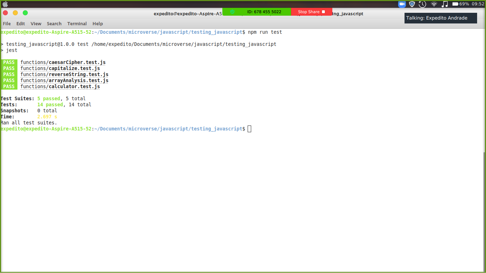

# Project Exploring Jest - Javascript

This is a project in which we explore the beautiful possibilities of testing in Javascript through the Jest test-running system.

### Screenshots

- Screenshot from the Terminal
  

### FEATURES

You can see how tests work in javascript in a very descriptve way.

### BUILT WITH

- Javascript
- Jest

### SETUP

- `git@github.com:mariosknl/testing_javascript.git`
- `run npm install on the root folder`
- `run npm test to see the tests`

### AUTHORS

👤 Marios Kanellopoulos

- Github: [@mariosknl](https://github.com/mariosknl)
- Twitter: [@mariosknl](https://twitter.com/MariosKnl)
- Linkedln: [marios-kanellopoulos](https://www.linkedin.com/in/marios-kanellopoulos)
- Portfolio: [marios-kanellopoulos](https://marioskanellopoulos.com/)

👤Expedito Andrade

- Github: [@githubexpjazz](https://github.com/expjazz)
- Twitter: [@expjazz](https://twitter.com/expeditoandrade13)
- Linkedin: [Expedito Andrade](https://www.linkedin.com/in/expedito-andrade/)
- Portfolio: [Expedito Andrade](https://expjazz.github.io/expedito_andrade/)

### Show your support

Give a star if you like this project!

### Acknowledgments

- Microverse
- Brad Traversy from Traversy Media.

### 🤝 Contributing

Contributions, issues, and feature requests are welcome!
Feel free to check the issues page.

### Show your support

Give a ⭐️ if you like this project!

### 📝 License

This project is MIT licensed
